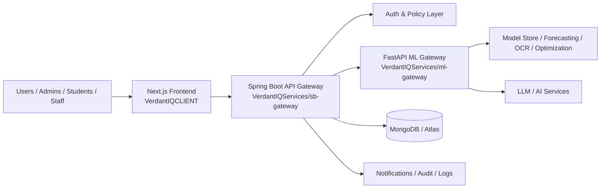
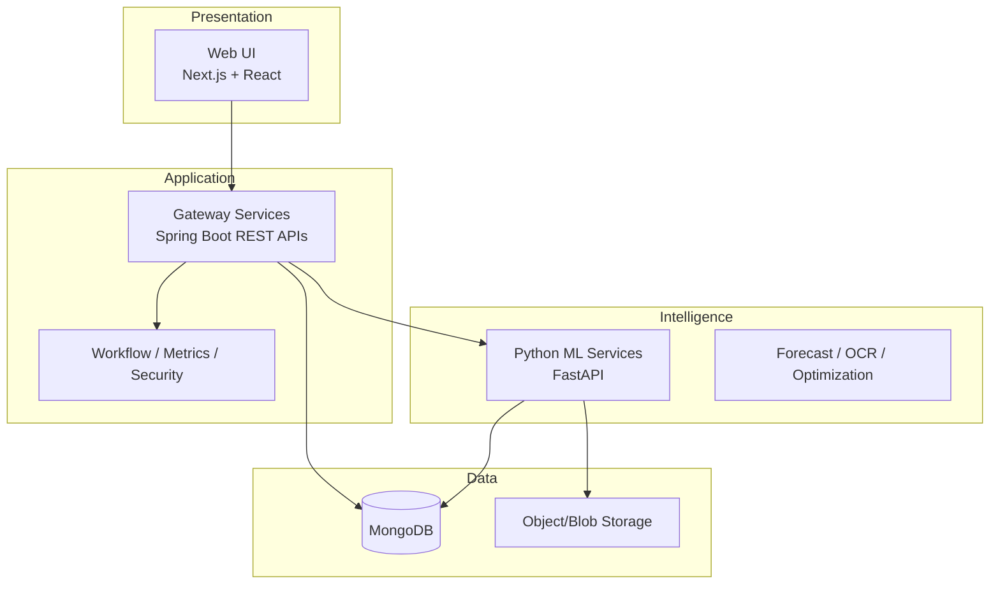
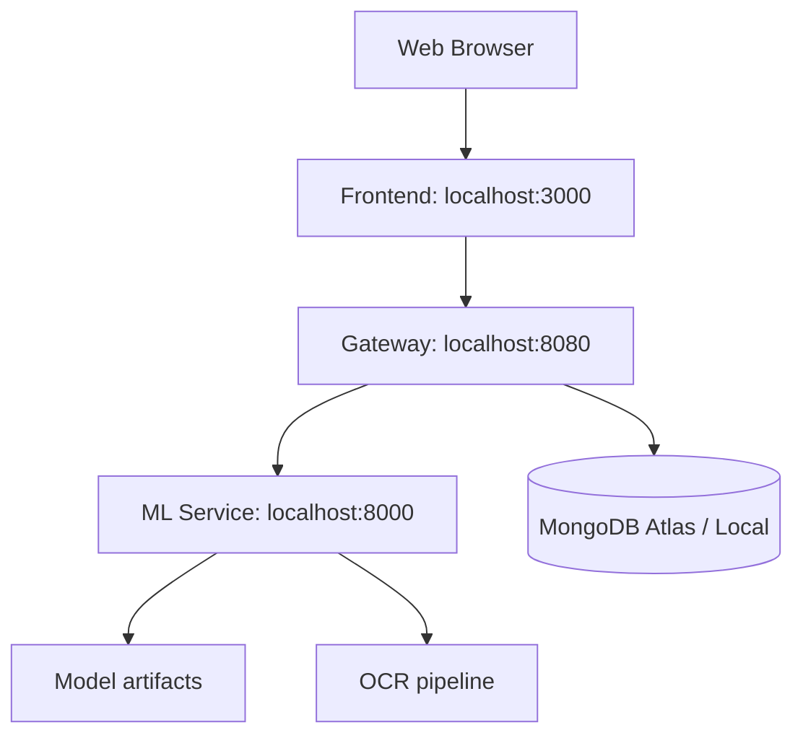
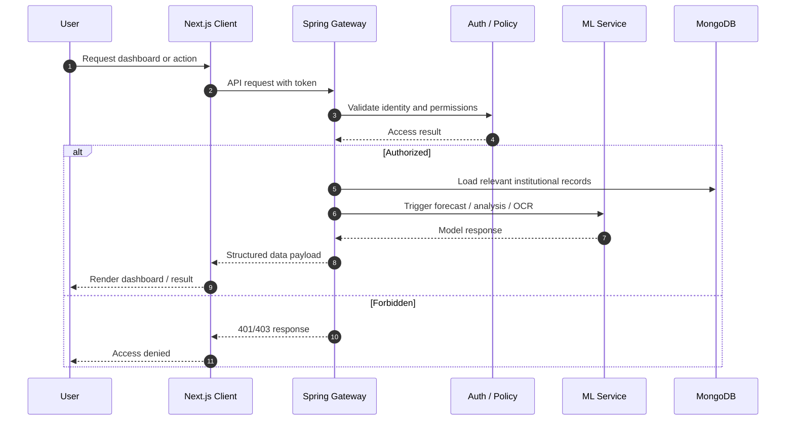
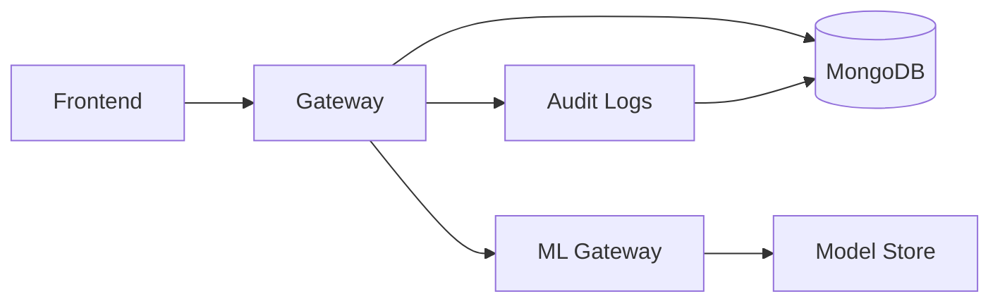
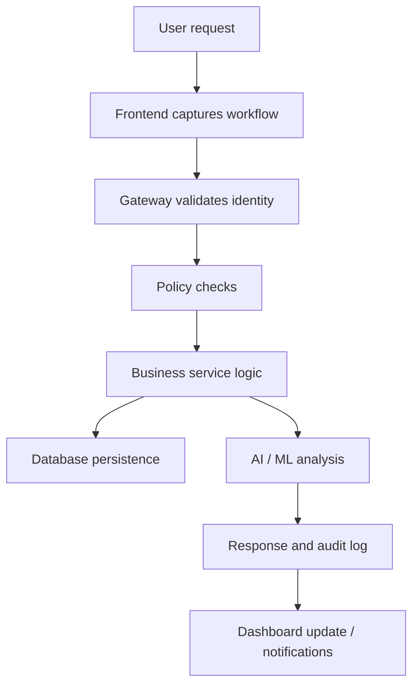
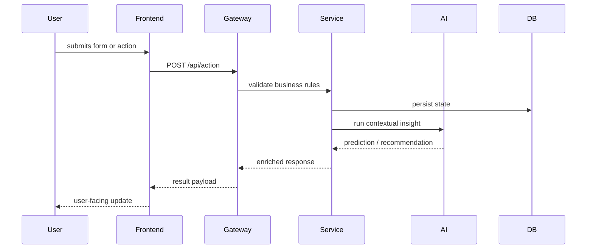
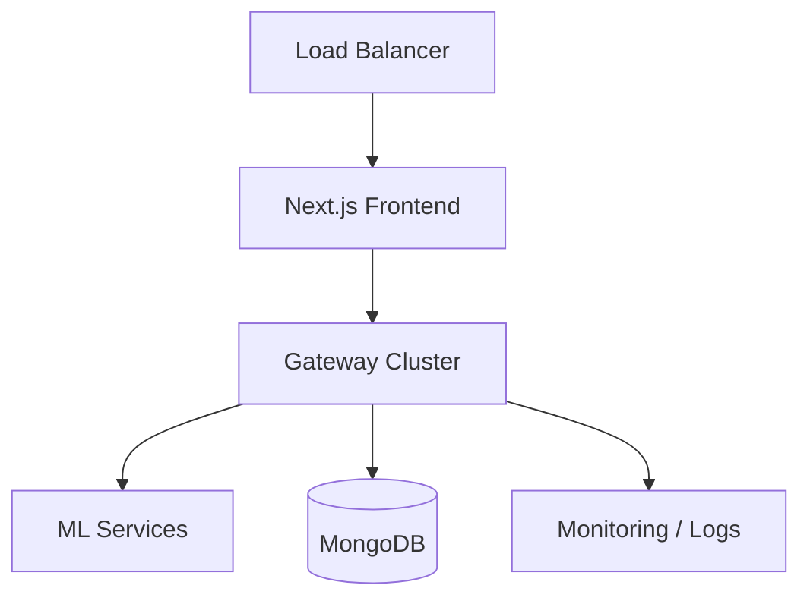

# VerdantIQ Ecosphere

<div align="center">


[](https://nextjs.org/)
[](https://react.dev/)
[](https://www.typescriptlang.org/)
[](https://spring.io/projects/spring-boot)
[](https://fastapi.tiangolo.com/)
[](https://www.mongodb.com/cloud/atlas)
[](https://www.python.org/)
[](https://openjdk.java.net/)
[](LICENSE)

</div>

```text
██╗   ██╗██████╗ ███████╗██████╗ ██╗██╗███████╗███████╗ ███████╗███████╗██╗   ██╗███████╗
██║   ██║██╔══██╗██╔════╝██╔══██╗██║██║██╔════╝██╔════╝ ██╔════╝██╔════╝██║   ██║██╔════╝
██║   ███║██████╔╝█████╗  ██████╔╝██║██║███████╗█████╗   █████╗  ███████╗██║   ██║█████╗
██║   ██║██╔══██╗██╔══╝  ██╔══██╗██║██║╚════██║██╔══╝   ██╔══╝  ╚════██║██║   ██║██╔══╝
╚██████╔╝██║  ██║███████╗██║  ██║██║██║███████║███████╗ ███████╗███████║╚██████╔╝███████╗
 ╚═════╝ ╚═╝  ╚═╝╚══════╝╚═╝  ╚═╝╚═╝╚═╝╚══════╝╚══════╝ ╚══════╝╚══════╝ ╚═════╝ ╚══════╝
```

## Tagline

AI-powered governance, operations, and decision intelligence platform for institutions, departments, and students.

## Overview

VerdantIQ Ecosphere is a multi-service platform designed to unify institutional oversight, operations management, student engagement, ML-driven insights, security controls, and domain-specific reporting into a single software ecosystem. The system combines a modern Next.js user experience, a Java-based gateway for enterprise-scale orchestration, and a Python-based ML service for forecasting, optimization, anomaly detection, OCR, and model-driven decision support.

The repository contains a full-stack architecture with clear separation of concerns:

- Frontend application for user interaction, dashboarding, and workflows
- API gateway for secure routing, security, authentication, and policy enforcement
- Python ML service for predictive analytics, optimization, LLM integration, and model management
- MongoDB-backed persistence for institutional data, access control, user state, and operational records
- System support scripts to simplify local development and operational startup

This project is intended for institutional settings, educational operations, regional governance, and AI-assisted decision environments where security, observability, and data quality matter.

---

## Developer Story

When building digital systems for modern educational and institutional organizations, we repeatedly encountered the same systemic problem: fragmented systems built around separate tools for reporting, operations, access management, workflow governance, and AI analytics. Teams ended up connecting spreadsheets, internal portals, legacy dashboards, and one-off scripts to compensate for gaps in a shared operating model.

VerdantIQ Ecosphere was built as a response to that fragmentation. The goal was to design a platform that could support real operational workflows without sacrificing clarity, security, or usability. Instead of treating each module as an isolated feature, the system was designed as a coherent product with common identity, data integrity, policy controls, and decision intelligence shared across all layers.

The project reflects a product mindset: build a system that is not only technically capable but also operationally useful to real teams. From the first wireframe to the current architecture, the emphasis has remained on reliability, data flow clarity, and ability to serve multiple stakeholders with different access needs.

### Why We Built It

We built VerdantIQ Ecosphere to solve a practical problem in modern organizations: the lack of a single command surface for operational oversight, academic/departmental processes, security reporting, AI reasoning, and domain intelligence.

Organizations need more than isolated dashboards; they need systems that can:

- track institutional performance and operational status,
- route tasks and approvals through clear actions,
- govern access and policy boundaries,
- detect anomalies and risk signals early,
- support complex decision workflows with explanation,
- preserve strong privacy and auditability controls.

The platform aims to close those gaps by combining workflow orchestration, AI, and governance under a common product architecture.

### Who We Are

This project represents a collaborative engineering effort focused on building software that can support operationally complex environments with strong user accountability and modern AI integrations. The work combines product design, software engineering, systems architecture, security, and data operations.

### Challenges Faced

The design and implementation process involved several key challenges:

1. Creating a clean multi-service architecture across multiple ecosystems.
2. Balancing user productivity with policy enforcement and auditability.
3. Integrating AI services without introducing ungoverned decision paths.
4. Supporting multiple access patterns for admins, students, departments, and institutions.
5. Managing real-world operational data integrity in a distributed service model.
6. Keeping the platform understandable for both developers and non-technical stakeholders.

### How We Built It

The platform was designed around a layered, service-oriented architecture:

- The frontend provides a polished, dashboard-led user experience.
- The gateway handles routing, authentication policies, and security enforcement.
- The ML service focuses on prediction and optimization tasks.
- Datastores preserve long-term state and relationship records.

This separation allows each domain to evolve independently while maintaining a single operational model for customers.

### Security & UX

Security and usability were treated as first-class concerns. The platform includes access boundaries, role-aware patterns, API-level controls, environment separation, and an attention to workflow clarity. The design supports both technical governance and product usability, rather than balancing them as separate goals.

### Key Learnings

The project reinforced several engineering lessons:

- clear boundaries reduce failure modes,
- observability is essential in distributed systems,
- AI features are more effective when grounded in explicit operational workflows,
- governance is a product feature, not just a technical checkbox,
- strong user design is required for operational adoption.

### Future Roadmap

The roadmap includes continued production hardening, deeper reporting automation, more advanced policy orchestration, stronger model governance, and expanded compatibility across broader institutional workflows.

### Developer Message

This project is designed for developers who care about maintainability, clarity, and systems thinking. It reflects a practical understanding that strong software is not only made of clean code but also of sensible boundaries, thoughtful security design, and realistic operational constraints.

---

## Table of Contents

- [1. Project Overview](#project-overview)
- [2. Product Vision and Goals](#product-vision-and-goals)
- [3. Platform Capabilities](#platform-capabilities)
- [4. Solution Architecture](#solution-architecture)
- [5. Services and Components](#services-and-components)
- [6. Repository Layout](#repository-layout)
- [7. Technology Stack](#technology-stack)
- [8. Local Development Setup](#local-development-setup)
- [9. Configuration and Environment Variables](#configuration-and-environment-variables)
- [10. Running the Full System](#running-the-full-system)
- [11. Frontend Application](#frontend-application)
- [12. API Gateway](#api-gateway)
- [13. ML Gateway](#ml-gateway)
- [14. Data and Persistence](#data-and-persistence)
- [15. Authentication and Authorization](#authentication-and-authorization)
- [16. Security and Privacy](#security-and-privacy)
- [17. API Contract and Integration Model](#api-contract-and-integration-model)
- [18. Workflow Documentation](#workflow-documentation)
- [19. Testing Strategy](#testing-strategy)
- [20. Deployment and Operations](#deployment-and-operations)
- [21. Monitoring and Observability](#monitoring-and-observability)
- [22. Troubleshooting](#troubleshooting)
- [23. Community and Contribution](#community-and-contribution)
- [24. GitHub CLI Workflow](#github-cli-workflow)
- [25. Roadmap](#roadmap)
- [26. FAQ](#faq)
- [27. License](#license)

---

## Project Overview

VerdantIQ Ecosphere is a multi-layer software system providing a complete operational and intelligence layer for institutions and related stakeholders. It is not just a dashboard—it is an operating system for data-driven decision flows, governance, and AI-enabled operations.

### Core Product Principles

- User-centered workflow design
- Clear domain boundaries
- Human-readable operational data
- Secure and auditable access
- AI assistance grounded in real process logic
- Reliable, maintainable multi-service architecture

### Strategic Goals

1. Develop a unified digital operations surface for institutional ecosystems.
2. Reduce operational inefficiency caused by fragmented systems.
3. Bring analytics and decision support closer to actual workflows.
4. Provide system-level observability for administrators and support teams.
5. Make AI utilities trustworthy and actionable rather than isolated experiments.

### Business Problems Solved

| Problem Area | Existing Pain | VerdantIQ Approach |
| --- | --- | --- |
| Operational visibility | Separate data sources and static reporting | Unified dashboards and real-time operational contexts |
| Access governance | Scattered permissions and unclear role boundaries | Centralized policy-aware authorization |
| Reporting complexity | Manual aggregation across sources | Shared data model and service-layer orchestration |
| AI adoption | Isolated models disconnected from tasks | Embedded workflow-aware ML features |
| Student and institutional coordination | Disjoint communication paths | Shared workflow and dashboard experience |
| Security and compliance | Hard-to-audit processes | Logging, policy enforcement, and audit artifacts |

---

## Product Vision and Goals

### Vision

To create a digital platform that gives institutions, departments, students, and administrators a unified way to understand operational realities, make informed decisions, and act on them with confidence.

### Mission

Build a platform that combines operational intelligence, governance, AI support, and accessible user workflows into a single cohesive software experience.

### Goals

- Provide useful operational dashboards for multiple audience types
- Support multi-tenant and domain-aware data handling
- Maintain strict boundaries for authentication and access control
- Empower operators with ML-driven forecasting and anomaly detection
- Scale cleanly from local implementation to larger production environments

---

## Platform Capabilities

### Core Capabilities

| Capability | Description | Example Usage |
| --- | --- | --- |
| Dashboard intelligence | Unified overview of operational information | Department-level performance review |
| Access and role control | Secure user interaction and domain-aware access | Admin, staff, student segmentation |
| Data workflows | Structured operations and event-driven processes | Approval and escalation management |
| Forecasting | Predictive models for planning and operations | Demand or performance forecasting |
| Anomaly detection | Identify abnormal trends and outliers | Risk or operational anomaly review |
| OCR and document processing | Extract information from uploaded documents | Document intake and validation |
| Optimization | Solve planning and scheduling issues | Resource and workload optimization |
| LLM gateway integration | Connect to AI reasoning services | Assistant and analytics support |
| Auditability | Capture traceable operational records | Compliance and review processes |
| Notification flows | Keep stakeholders informed | Alerts, updates, and escalation events |

### Stakeholder View

| Audience | Primary Need | Platform Response |
| --- | --- | --- |
| Administrators | Oversight and policy | Dashboarding, access controls, AI insights |
| Department leads | Team performance and approvals | Department analytics and workflows |
| Institution leaders | Governance and strategic overview | Reporting, benchmarks, and trend analysis |
| Students | Personalized experience | Student dashboard and academic-related workflows |
| Support teams | Incident awareness | Monitoring, alerts, and operational records |
| Platform operators | Reliability and health | Service monitoring, logs, and health routes |

---

## Solution Architecture

### High-Level Architecture



### Layered System Model



### Deployment Topology



### Sequence Diagram



---

## Services and Components

### 1. Frontend Application

The frontend is implemented in the [VerdantIQCLIENT](VerdantIQCLIENT) directory. It is a Next.js application built around route-driven dashboards, institutional modules, and feature-specific UI experiences.

It includes:

- landing pages and authentication screens,
- role-aware dashboards,
- institutional and department views,
- audit and reporting sections,
- admin and monitoring modules,
- AI and ML operational surfaces.

### 2. API Gateway

The Java gateway lives in [VerdantIQServices/sb-gateway](VerdantIQServices/sb-gateway). It coordinates most application traffic and provides:

- dependency injection for service boundaries,
- route management,
- JWT/Firebase-based validation patterns,
- security configuration,
- database access and document models,
- audit and activity record infrastructure,
- notification and SSE support,
- proxying to ML workloads and support services.

### 3. ML Gateway

The Python service is in [VerdantIQServices/ml-gateway](VerdantIQServices/ml-gateway). It provides:

- FastAPI route exposure,
- model loading and metadata handling,
- forecasting endpoints,
- anomaly detection logic,
- OCR-related operational routes,
- optimization and scheduling endpoints,
- AI and LLM gateway services.

### 4. Shared Product Domain Boundary

The product is organized around business domains such as:

- admin,
- institution,
- department,
- region,
- student,
- audit,
- security,
- notifications,
- tenant privacy,
- MLOps.

These domain modules are intentionally separated to improve maintainability and domain clarity.

---

## Repository Layout

```text
Ecosphere/
├── .gitignore
├── LICENSE
├── README.md
├── start up
├── VerdantIQ_System_Tracker_and_Roadmap.xlsx
├── VerdantIQCLIENT/
│   ├── .env
│   ├── .eslintrc.json
│   ├── eslint.config.mjs
│   ├── middleware.ts
│   ├── next.config.ts
│   ├── package.json
│   ├── tsconfig.json
│   ├── app/
│   │   ├── error.tsx
│   │   ├── global-error.tsx
│   │   ├── globals.css
│   │   ├── layout.tsx
│   │   ├── page.tsx
│   │   ├── providers.tsx
│   │   ├── 403/
│   │   ├── admin/
│   │   ├── admin-dashboard/
│   │   ├── api/
│   │   ├── assistant/
│   │   ├── audit/
│   │   ├── audit-dashboard/
│   │   ├── dept/
│   │   ├── dept-dashboard/
│   │   ├── design-system/
│   │   ├── help/
│   │   ├── household-dashboard/
│   │   ├── institution/
│   │   ├── institution-dashboard/
│   │   ├── landing/
│   │   ├── login/
│   │   ├── logout/
│   │   ├── mlops/
│   │   ├── mlops-dashboard/
│   │   ├── my-activity/
│   │   ├── notifications/
│   │   ├── onboarding/
│   │   ├── profile/
│   │   ├── region/
│   │   ├── security/
│   │   ├── settings/
│   │   ├── student/
│   │   ├── student-dashboard/
│   │   ├── tenant-request/
│   │   ├── user/
│   │   └── ...
│   ├── components/
│   │   ├── auth/
│   │   ├── dashboard/
│   │   ├── dev/
│   │   ├── landing/
│   │   ├── mlops/
│   │   ├── region/
│   │   ├── shared/
│   │   ├── shell/
│   │   └── ui/
│   ├── context/
│   │   ├── AuthContext.tsx
│   │   ├── MacThemeContext.tsx
│   │   └── VoiceCommandContext.tsx
│   ├── docs/
│   │   ├── API_CONTRACT.md
│   │   └── metadata.json
│   ├── hooks/
│   │   └── use-mobile.ts
│   ├── lib/
│   │   ├── firebase.ts
│   │   ├── mongodb.ts
│   │   ├── utils.ts
│   │   ├── api/
│   │   ├── auth/
│   │   ├── data/
│   │   ├── hooks/
│   │   └── services/
│   ├── public/
│   └── scripts/
│       └── refactor_endpoints.js
│
├── VerdantIQServices/
│   ├── ml-gateway/
│   │   ├── .env
│   │   ├── .env.example
│   │   ├── pyproject.toml
│   │   ├── README.md
│   │   ├── test_fastapi_routes.py
│   │   ├── test_middleware.py
│   │   └── app/
│   │       ├── __init__.py
│   │       ├── main.py
│   │       ├── api/
│   │       ├── core/
│   │       ├── model_store/
│   │       └── schemas/
│   └── sb-gateway/
│       ├── .gitattributes
│       ├── .gitignore
│       ├── HELP.md
│       ├── mvnw
│       ├── pom.xml
│       ├── report.md
│       ├── src/
│       ├── target/
│       └── ...
└── ...
```

---

## Technology Stack

### Frontend

| Component | Technology |
| --- | --- |
| UI framework | Next.js 15 |
| Rendering | React 19 |
| Language | TypeScript |
| Styling | Tailwind CSS |
| Motion/visualization | Framer Motion / CSS animation / Three.js |
| Data access | Fetch APIs / service modules |

### Backend

| Component | Technology |
| --- | --- |
| API gateway | Spring Boot 4 |
| Python ML service | FastAPI |
| Language | Java 17 / Python 3.11 |
| HTTP layer | REST APIs, controllers, route handlers |
| Runtime | Uvicorn, Maven, Spring Boot runtime |

### Data and Persistence

| Component | Technology |
| --- | --- |
| Primary database | MongoDB |
| Cloud deployment | MongoDB Atlas |
| Document modeling | Spring Data MongoDB |
| Data serialization | JSON |

### Authentication and Security

| Component | Technology |
| --- | --- |
| Identity and access | Firebase Auth patterns |
| Token validation | custom middleware and security filters |
| Policy enforcement | route-level checks and service guards |
| Secret handling | environment variables |
| Application security | Spring Security, API checks |

### AI Services

| Component | Technology |
| --- | --- |
| Model hosting | FastAPI endpoints |
| Forecasting | scikit-learn, XGBoost |
| Optimization | OR-Tools |
| OCR | Tesseract / PIL / Python image pipeline |
| LLM gateway | Service adapters and gateway routing |
| Model artifacts | local model store with metadata |

---

## Local Development Setup

### Prerequisites

Before running the project locally, ensure the following are installed:

- Git
- Node.js 20+
- npm
- Python 3.11+
- Java 17+
- Maven wrapper included in the Java project
- MongoDB access capability for the configured Atlas URI

### Clone

```bash
git clone https://github.com/TheOrionGD/VERDENTIQ-ECHOSPHERE.git
cd VERDENTIQ-ECHOSPHERE
```

### Install Frontend Dependencies

```bash
cd VerdantIQCLIENT
npm install
```

### Install Python Dependencies

```bash
cd VerdantIQServices/ml-gateway
python -m venv .venv
source .venv/bin/activate   # Linux/macOS
# or .venv\Scripts\activate  # Windows
pip install -U pip
pip install -e .
```

### Build Java Gateway

```bash
cd VerdantIQServices/sb-gateway
./mvnw clean install
```

### Verify Tools

```bash
node -v
npm -v
python --version
java -version
```

---

## Configuration and Environment Variables

### Frontend

The frontend uses environment variables for external access configuration. Example values:

```env
NEXT_PUBLIC_GATEWAY_URL=http://localhost:8080
NEXT_PUBLIC_ML_GATEWAY_URL=http://localhost:8000
NEXT_PUBLIC_APP_ENV=development
```

### ML Gateway

Example configuration file:

```env
INTERNAL_SERVICE_KEY=<set-in-process-environment>
APP_ENV=development
MODEL_PATH=./app/model_store
LOG_LEVEL=INFO
```

### Spring Boot Gateway

The gateway reads its runtime configuration from application properties/yaml. Example:

```yaml
server:
  port: 8080

spring:
  data:
    mongodb:
      uri: ${MONGODB_URI}
```

### Security Notes

- Do not commit secrets to source control.
- Use environment variables or local secret management for production credentials.
- Keep service keys different across local, test, and production environments.

---

## Running the Full System

A startup helper document exists in the root of the repository:

- [start up](start%20up)

### Service Launch Commands

Refer to the [`start up`](start%20up) document for complete instructions. Here are the core service commands:

```powershell
# 1. ML Gateway (FastAPI — Port 8000)
cd VerdantIQServices/ml-gateway
uvicorn app.main:app --reload --host 0.0.0.0 --port 8000

# 2. Spring Boot Gateway (Java — Port 8080)
cd VerdantIQServices/sb-gateway
.\mvnw.cmd spring-boot:run

# 3. Next.js Client (Port 3000)
cd VerdantIQCLIENT
npm run dev
```

### Manual Startup Sequence

#### 1. Start ML Service

```bash
cd VerdantIQServices/ml-gateway
python -m uvicorn app.main:app --host 0.0.0.0 --port 8000
```

#### 2. Start Spring Boot Gateway

```bash
cd VerdantIQServices/sb-gateway
./mvnw spring-boot:run
```

#### 3. Start Frontend

```bash
cd VerdantIQCLIENT
npm run dev
```

### Health Endpoints

| Service | Endpoint | Purpose |
| --- | --- | --- |
| ML Service | http://localhost:8000/docs | Swagger docs |
| ML Health | http://localhost:8000/health | Basic health check |
| Gateway | http://localhost:8080 | API gateway entry |
| Frontend | http://localhost:3000 | App UI |

---

## Frontend Application

### Frontend Structure

The frontend uses a modular route architecture built around dashboard flows and domain-specific sections. The root app contains sections for:

- admin operations,
- institution dashboards,
- department workflows,
- student contexts,
- security policy surfaces,
- MLOps and model oversight,
- help and documentation,
- notifications and settings.

### UI Architecture Patterns

The application uses reusable patterns such as:

- shell layout,
- provider wrappers,
- dashboard cards,
- data tables,
- shared service layers,
- route-based feature organization,
- contextual providers for authentication and theme.

### Frontend Development Workflow

```bash
cd VerdantIQCLIENT
npm run dev
npm run build
npm run lint
```

### Common Frontend Notes

- UI routes are organized by business role and domain.
- Shared assets live under [VerdantIQCLIENT/components](VerdantIQCLIENT/components).
- Service-layer logic is separated into [VerdantIQCLIENT/lib](VerdantIQCLIENT/lib).
- Context providers centralize state concerns for auth, theme, and voice interactions.

---

## API Gateway

The Spring Boot gateway acts as the central orchestration layer between the UI and service backends.

### Gateway Responsibilities

- expose public REST endpoints,
- secure and validate traffic,
- provide routing and proxy behaviors,
- manage audit and activity logging,
- coordinate access to MongoDB-backed entities,
- connect to ML workflows,
- support notification and operational streaming patterns.

### Gateway Features

- MongoDB integration
- Firebase-related auth flows
- OpenAPI documentation support
- security and validation layers
- domain-based controllers and services
- notifications and alerts
- PDF and document-processing support where needed

### Basic Run Command

```bash
cd VerdantIQServices/sb-gateway
./mvnw spring-boot:run
```

### Observability

The project includes actuator support, so health and runtime diagnostics can be leveraged for operational visibility.

---

## ML Gateway

The ML service provides model-based intelligence to the broader system. It is intentionally separated from the main web application so model logic can evolve independently and remain focused on inference and optimization tasks.

### ML Gateway Responsibilities

- expose ML inference routes,
- serve model artifacts,
- support forecasting,
- detect anomalies,
- run optimization routines,
- enable LLM-related orchestration,
- support OCR and document workflows,
- provide health and diagnostics endpoints.

### Model Store

```text
VerdantIQServices/ml-gateway/app/model_store/
├── forecast_v1.0.0/
│   └── metadata.json
├── forecast_v1.1.0/
│   └── metadata.json
```

### Example ML Route Usage

```bash
curl -X GET "http://localhost:8000/health"
```

### FastAPI Docs

Open the Swagger UI at:

```text
http://localhost:8000/docs
```

---

## Data and Persistence

### Database Strategy

The project uses MongoDB as the core operational data store. This supports flexible document models for operational records, user data, institutional metadata, alerts, access rules, and workflow state.

### Persistence Principles

- Domain-owned collections
- document-oriented flexibility
- scalable application data model
- support for indexing and query optimization
- explicit separation between operational and analytical state

### Data Flow Pattern



---

## Authentication and Authorization

Authentication and authorization are critical for the system because different user groups and operational domains require different permissions.

### Current Patterns

- Firebase-style identity integration,
- authentication checks in gateway and service layers,
- policy enforcement around API routes,
- token validation in request processing,
- role-aware access boundaries for dashboards and features.

### Access Model

| Role | Typical Permissions |
| --- | --- |
| Admin | Full governance and operational oversight |
| Department lead | Domain-level reporting and approval workflows |
| Institution user | Institutional data and operations |
| Student | Student-specific dashboard and workflows |
| Support operator | Monitoring and incident response |

### Recommended Best Practice

Use least-privilege access and manage role definitions centrally instead of scattering permission checks across UI-only flows.

---

## Security and Privacy

As a platform that handles institutional data and operational workflows, security is treated as a product requirement rather than an afterthought.

### Security Controls

- environment-based secret management,
- token validation and route authorization,
- audit logging of action paths,
- domain-aware data boundaries,
- restricted exposure between services,
- local versus production environment separation,
- secure API design and structured routing patterns.

### Privacy Considerations

- minimize unnecessary retention of sensitive data,
- separate personally identifiable records from operational logs where possible,
- maintain explicit access boundaries for sensitive institutional records,
- avoid exposure of internal system metadata in UI responses,
- clearly document data usage for users and administrators.

### Security Checklist

- [ ] verify all secrets are in environment variables
- [ ] review all route-level auth guards
- [ ] validate external service access policies
- [ ] confirm MongoDB access is safe and restricted
- [ ] ensure logs exclude sensitive personal data
- [ ] validate secure session/token handling

---

## API Contract and Integration Model

The system exposes a mix of frontend-driven requests and service-to-service interactions.

### API Style

- REST-style endpoints
- JSON payloads
- token-based validation in gateway layer
- structured error responses
- resource-oriented route organization

### Example Request

```bash
curl -X GET "http://localhost:8080/api/health" \
  -H "Authorization: Bearer <token>"
```

### Example Response

```json
{
  "status": "ok",
  "service": "gateway",
  "timestamp": "2026-08-18T00:00:00Z"
}
```

### API Documentation

- Frontend-facing API documentation is present in [VerdantIQCLIENT/docs/API_CONTRACT.md](VerdantIQCLIENT/docs/API_CONTRACT.md)
- FastAPI automatically serves OpenAPI docs at the Python service
- Spring Boot integrates with OpenAPI tooling for gateway docs

---

## Workflow Documentation

### Institutional Workflow Example



### Decision Flow Example



---

## Testing Strategy

### Testing Philosophy

The project is built around layered validation to ensure quality from the UI to the service boundary.

### Current Test Coverage

| Layer | Focus | Examples |
| --- | --- | --- |
| Frontend | UI build integrity, linting | Next.js build, TypeScript validation |
| Gateway | application startup and service behavior | Spring Boot tests |
| ML service | API health and middleware | FastAPI route tests |
| Integration | cross-service behavior | local startup verification |

### Validation Commands

```bash
cd VerdantIQCLIENT
npx tsc --noEmit
npm run build
npm run lint
```

```bash
cd VerdantIQServices/ml-gateway
python -m pytest
```

```bash
cd VerdantIQServices/sb-gateway
./mvnw test
```

### What Good Testing Looks Like

- health checks for each service,
- API contract validity,
- environment-specific validation,
- regression testing when workflows evolve,
- safe handling of off-network database conditions.

---

## Deployment and Operations

### Local Development

The project is designed for local startup and debugging. A root-level launcher script is included to start multiple dependency paths in one workflow.

### Production Considerations

For production deployment, consider:

- environment separation,
- reverse proxy layers,
- TLS termination,
- secret management,
- health checks and graceful startup,
- managed MongoDB or Atlas isolation,
- centralized logs,
- backup and restore strategy,
- load balancing for service scaling.

### Deployment Model Example



---

## Monitoring and Observability

### Key Monitoring Areas

- service startup health,
- request failures,
- database connectivity and latency,
- model inference runtime,
- anomaly or error rates,
- frontend API calls,
- user flows and adoption signals.

### Recommended Observability Stack

| Concern | Recommended Tooling |
| --- | --- |
| Logging | structured app logs |
| Metrics | uptime and latency tracking |
| Health checks | service readiness endpoints |
| Error tracking | centralized exception logs |
| Alerts | notification service / incident routing |

---

## Troubleshooting

### Common Issues

#### 1. MongoDB connection problems

Symptoms:

- Spring gateway fails to start
- database-related exceptions appear in logs
- application context initialization fails

Root cause:

- network access to Atlas or configured database endpoint is unavailable,
- credentials or URI formatting are invalid,
- firewall or network policy blocks outbound DB access.

Recommended action:

- verify DB connectivity from the host,
- confirm the configured MongoDB URI is valid,
- ensure the environment allows outbound access,
- keep the connection string intentional and avoid altering it without justification.

#### 2. Frontend build or TypeScript issues

Symptoms:

- `baseUrl` deprecation warnings,
- compiler warnings,
- missing configuration in TypeScript.

Typical fix:

```json
{
  "compilerOptions": {
    "ignoreDeprecations": "6.0"
  }
}
```

#### 3. ML service not starting

Check:

- Python version compatibility,
- virtual environment activation,
- dependency install status,
- missing environment variables,
- port conflicts.

#### 4. Gateway not responding

Check:

- Java version is 17,
- Maven wrapper is executable,
- environment variables are set,
- database and authentication dependencies are reachable,
- port 8080 is free.

### Useful Commands

```bash
curl http://localhost:8000/health
curl http://localhost:8080/actuator/health
```

```bash
netstat -ano | findstr :3000
netstat -ano | findstr :8080
netstat -ano | findstr :8000
```

---

## Community and Contribution

Contributions are welcomed from developers, designers, data specialists, security reviewers, and testers.

### Contribution Workflow

1. Fork the repository
2. Create a feature branch
3. Implement changes with tests where appropriate
4. Validate the relevant stack layers
5. Submit a pull request with clear summary and impact notes

### Contribution Expectations

- keep commit history readable,
- use clear and descriptive commit messages,
- avoid introducing debug-only changes to production code,
- document new config requirements,
- include validation evidence in pull requests.

### Code Review Expectations

- architecture and design review,
- security review for auth flow changes,
- performance review for new APIs,
- logging and observability review for service changes,
- data/privacy review for new features.

---

## GitHub CLI Workflow

The repository supports a straightforward GitHub CLI workflow for day-to-day maintenance and collaboration.

### Small Project Description

```bash
gh repo edit --description "VerdantIQ Ecosphere is an AI-powered institutional operations and decision intelligence platform built with Next.js, Spring Boot, FastAPI, and MongoDB."
```

### Add Topics

```bash
gh repo edit --add-topic "nextjs,react,typescript,fastapi,spring-boot,mongodb,ai,analytics,education"
```

### View Repository

```bash
gh repo view --web
```

### Create an Issue

```bash
gh issue create --title "Add production deployment checklist" --body "Document runtime prerequisites and environment configuration for production rollout."
```

### Create a Pull Request

```bash
gh pr create --base main --head feature/branch-name --title "Add dashboard improvements" --body "Summary of UI changes and validation steps."
```

### Open a Branch

```bash
git checkout -b feature/my-update
```

### Check Remote Status

```bash
git remote -v
git status
```

### Push with GitHub CLI Support

```bash
gh auth login
```

Then standard Git commands continue to work:

```bash
git add .
git commit -m "Improve backend and documentation"
git push origin HEAD
```

### Release Notes Workflow

```bash
gh release create v0.1.0 --title "Initial system release" --notes "Initial multi-service platform release with frontend, gateway, and ML capabilities."
```

### Workflow Execution

```bash
gh workflow list
gh run list
```

These commands are especially useful when the repository is used as a shared product or academic project repository.

---

## Roadmap

### Near-Term

- formalize production deployment environment files,
- improve service health checks and readiness criteria,
- expand route-level documentation,
- add deeper ML model governance and metadata tracking,
- verify end-to-end path across the full stack in stable conditions.

### Medium-Term

- stronger analytics and decision workflows,
- operational dashboards with richer drilldowns,
- role-aware reporting and policy controls,
- expanded assistant and LLM workflows,
- broader observability and debugging surfaces.

### Long-Term

- enterprise-scale deployment support,
- multi-region or multi-tenant architecture readiness,
- advanced automation, event-driven processing, and AI orchestration,
- deeper audit and compliance tooling,
- stronger product integrations with external institutional systems.

---

## FAQ

### What is VerdantIQ Ecosphere?

VerdantIQ Ecosphere is a multi-service software platform for institutional operations, governance, AI assistance, and decision support.

### Why does it use multiple services?

Service separation allows domain clarity, maintainability, and independent evolution of the frontend, API layer, and ML logic.

### Is this suitable for production?

The codebase is structured for production-minded development, but production deployment still requires environment hardening, strong secret management, and infrastructure validation.

### Can I run it locally?

Yes. The repo includes scripts and direct run instructions for local development.

### Why is MongoDB important?

It provides the persistent document store for operational state, users, records, and domain-related data.

### Why does the system include AI features?

AI features are useful when tied to business workflows such as forecasting, anomaly detection, optimization, and operational insight.

### Do I need Docker?

Not necessarily for local development. The project currently supports a straightforward local startup model.

### Can the frontend and backend be run separately?

Yes. Each subsystem is designed to run independently in a development environment.

---

## License

This project is licensed under the MIT License.

See the [LICENSE](LICENSE) file for details.

---

## Project Status and Notes

This repository is actively structured as a full-stack, multi-service product platform. It is designed for local development and progressive scaling toward broader deployment scenarios.

The work currently emphasizes:

- service separation,
- multi-domain product architecture,
- secure API design,
- operational observability,
- AI-enriched workflows,
- institutional decision support.

---

## Appendix: Screenshots and Product UI Placeholders

The following placeholders are reserved for product documentation and demo screenshots.

```markdown


```

Add these assets under a `docs/screenshots/` directory to keep product documentation visually rich and release-ready.

---

## Quick Reference

### Core Commands

```bash
# frontend
cd VerdantIQCLIENT && npm install && npm run dev

# ML service
cd VerdantIQServices/ml-gateway && python -m uvicorn app.main:app --host 0.0.0.0 --port 8000

# gateway
cd VerdantIQServices/sb-gateway && ./mvnw spring-boot:run
```

### Git Commands

```bash
git status
git add .
git commit -m "Update system documentation"
git push origin theoriongd
```

### GitHub CLI Commands

```bash
gh repo view --web
gh issue create --title "Describe the issue" --body "Detailed description"
gh pr create --base main --head feature/branch-name --title "Feature update" --body "Summary"
```

---

## Final Message

VerdantIQ Ecosphere is a platform built around practical operational intelligence. It combines a strong frontend experience, a backend coordination layer, and ML-powered capabilities to support modern institutional and decision-driven work. The project is designed to be extensible, maintainable, and production-aware while remaining approachable for contributors and stakeholders alike.

The architecture and documentation in this repository are intended to make it easier to understand the system, operate it locally, contribute responsibly, and evolve it into a stronger product over time.

---

## Repository Summary

- Project: VerdantIQ Ecosphere
- Type: AI-enabled web platform and operations system
- Frontend: Next.js + React + TypeScript
- Backend Gateway: Spring Boot + Java
- ML Service: FastAPI + Python
- Database: MongoDB
- Auth Pattern: Firebase-style security and custom validation
- Primary Purpose: institutional operations, governance, and AI-assisted decision support

This README was prepared to meet a professional documentation standard for a modern software platform and to serve as a clear onboarding and operational reference for the repository.
