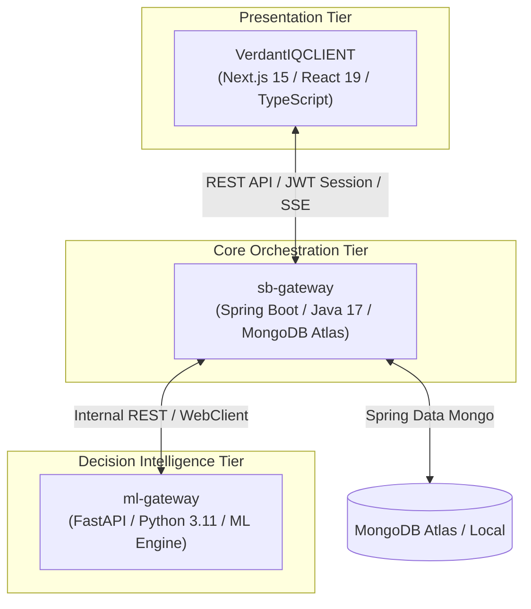
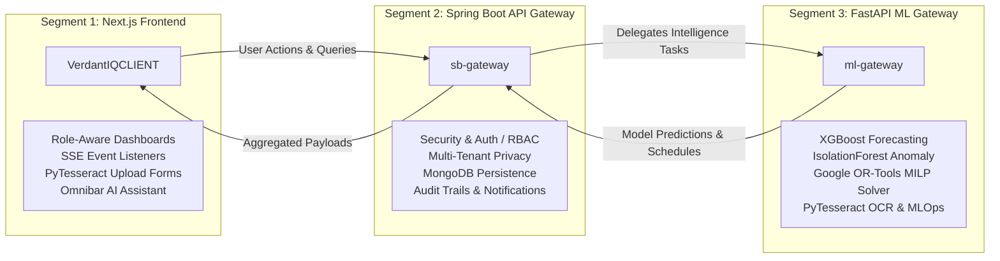
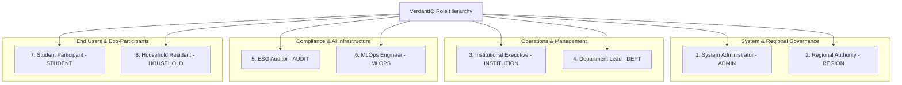
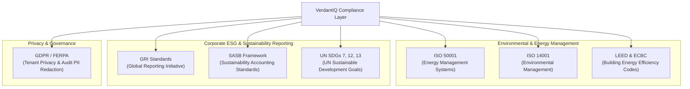

# VerdantIQ Ecosphere - Complete System Architecture & Role Feature Matrix

> **Source Code Analysis Report**  
> **Target Workspace:** `o:\PROJECTS\Ecosphere`  
> **Analyzed Microservices:** `VerdantIQCLIENT` (Next.js 15), `sb-gateway` (Spring Boot 4 / Java 17), `ml-gateway` (FastAPI / Python 3.11), and MongoDB Persistence.

---

## 1. Executive Summary & System Vision

**VerdantIQ Ecosphere** is an enterprise-grade, AI-driven decision intelligence, governance, and operational platform tailored for environmental science, sustainability management, institutional governance, and academic ecosystems.

The platform addresses operational fragmentation by unifying institutional oversight, resource tracking (energy, carbon, cost, water, waste), ESG compliance auditing, ML-based predictive analytics, and individual eco-engagement into a **3-tier microservices architecture**.

---

## 2. Microservice Segmentation (The 3 Core Pillars)

The codebase is strictly organized into three distinct microservices. Each segment performs a designated operational role:

### 2.1 Segment 1: Presentation & User Experience (`VerdantIQCLIENT`)
* **Technology Stack:** Next.js 15, React 19, TypeScript, Vanilla CSS design tokens, dynamic charts.
* **Core Function:** 
  * Serves role-customized user interfaces for all 8 user personas.
  * Enforces route-level session authentication via `middleware.ts`.
  * Renders real-time telemetry, interactive energy charts, and sustainability scorecards.
  * Collects user actions, utility bill images for OCR, and AI assistant query streams.

### 2.2 Segment 2: Enterprise Gateway & Core Business Logic (`sb-gateway`)
* **Technology Stack:** Java 17, Spring Boot 4.x, Spring Security, Spring Data MongoDB, Spring WebFlux (`WebClient`).
* **Core Function:**
  * **API Gateway & Routing:** Single entry point for client requests (`http://localhost:8080`).
  * **Authentication & RBAC:** Validates session tokens, resolves user roles, and enforces endpoint authorization.
  * **Persistence Management:** Interacts with MongoDB Atlas collections (`users`, `activities`, `institutions`, `departments`, `audits`, `telemetry`).
  * **Service Orchestration:** Proxies ML analytics requests to `ml-gateway` (`http://localhost:8000`) and enriches payloads with institutional records.
  * **Audit & Telemetry:** Records redacted audit trails, system broadcasts, and handles Server-Sent Events (SSE) for real-time alerts.

### 2.3 Segment 3: Machine Learning & Decision Intelligence (`ml-gateway`)
* **Technology Stack:** Python 3.11, FastAPI, XGBoost, Scikit-Learn (IsolationForest), Google OR-Tools (MILP SCIP Solver), PyTesseract, PIL, Pandas, NumPy.
* **Core Function:**
  * **Predictive Forecasting (`forecast.py`):** Trains XGBoost regressors on historical consumption data to generate 30-day future forecasts for $kWh$ saved and carbon reduction.
  * **Anomaly Detection (`anomaly.py`):** Utilizes IsolationForest (contamination rate = 5%) on multidimensional operational metrics ($kWh$, $kg CO_2$, $USD$, EcoPoints) to detect abnormal spikes or leaks.
  * **Multi-Objective Optimization (`optimization.py`):** Solves Mixed-Integer Linear Programming (MILP) models using Google OR-Tools SCIP solver to maximize global environmental and economic efficiency:
    $$\text{Maximize } Z = \sum \left( w_{\text{carbon}} \cdot |\Delta \text{Carbon}| + w_{\text{cost}} \cdot |\Delta \text{Cost}| + w_{\text{comfort}} \cdot \text{EaseScore} \right)$$
  * **Document Processing OCR (`ocr.py`):** Extracts raw text from utility bills, invoices, and certificates via PyTesseract.
  * **MLOps Lifecycle (`mlops.py`, `audit.py`):** Manages model registry, physical artifact stores (`model_store/`), automated retraining schedules (Cron), canary deployments, and generates AI fairness reports.

---

## 3. Comprehensive 8-Role User Feature Matrix (20+ Features Per Role)

The platform enforces strict role separation across **8 distinct user personas**. Below is the exhaustive breakdown of features, inputs, outputs, and access boundaries for every single role.

---

### 3.1 Role 1: System Administrator (`ADMIN`)

* **Target Audience:** IT Administrators, Platform Security Leads, Infrastructure Engineers.
* **Access Routes:** `/admin-dashboard`, `/admin/*`, `/security`, `/settings`.
* **Backend Packages:** `com.verdantiq.gateway.admin`, `com.verdantiq.gateway.auth`, `com.verdantiq.gateway.config`.

#### 20 Core Features (System Administrator)
1. **Global User Access Management:** Create, suspend, modify, or terminate user accounts across all tenant organizations.
2. **Role-Based Access Control (RBAC) Mapping (`RBACSchemaRole.java`):** Define granular permissions and dynamic role assignments.
3. **API Rate Limiting & Quota Management (`RateLimitFilter.java`):** Set request limits per minute/hour per tenant or IP address.
4. **Platform Security Configuration (`SecurityConfig.java`):** Manage CORS policies, CSRF tokens, and OAuth2/JWT security parameters.
5. **System Broadcast Dispatcher (`SystemBroadcast.java`):** Publish system-wide announcements, maintenance alerts, and emergency notifications.
6. **Feature Flag Manager (`FeatureFlag.java`):** Enable or disable platform capabilities dynamically without system redeployment.
7. **Telemetry & Microservice Monitoring (`TelemetryAggregatorService.java`):** Real-time cluster health, latency, CPU, and memory metrics.
8. **Access Grant Manager (`AccessGrant.java`):** Review and grant temporary elevated privileges to technical support personnel.
9. **Global Audit Log Viewer (`AdminAuditLog.java`):** Search, filter, and inspect non-redacted platform execution logs.
10. **Database Health & Status Monitor (`DatabaseStatus.java`):** Monitor MongoDB connection pools, index status, and query latencies.
11. **Tenant Provisioning & Onboarding:** Initialize new institutional databases, schema isolations, and domain configurations.
12. **Internal Service Key Management:** Rotate internal secrets and security tokens connecting Spring Boot to FastAPI.
13. **API Endpoint Registry Inspection:** Monitor active Spring Boot controllers and FastAPI route health mappings.
14. **Global Session Revocation:** Invalidate active user session tokens (`verdantiq_session`) during security incidents.
15. **System Maintenance Mode Switch:** Put the platform into read-only mode during major database migrations or upgrades.
16. **Environment Configuration Overrides:** Inspect active `.env` properties, JVM parameters, and Spring active profiles (`local`/`prod`).
17. **Global Error Rate Alerting:** Configure thresholds for automatic administrator alerts on 5xx gateway errors.
18. **Third-Party API Integration Settings:** Manage API keys and rate limits for external LLM endpoints (OpenAI/Gemini/Groq).
19. **Backup & Disaster Recovery Triggers:** Initiate automated snapshot triggers for MongoDB Atlas storage.
20. **Admin Dashboard Telemetry Overview:** Visual grid displaying active users, memory footprint, throughput, and error rates.

* **Inputs Collected:** User credentials, rate limit thresholds, feature flag toggles, system broadcast text, role permission arrays, IP whitelists.
* **Outputs Displayed:** System health dashboard, microservice latency graphs, active connection counts, audit log tables, rate-limit violation logs.

---

### 3.2 Role 2: Regional Authority (`REGION`)

* **Target Audience:** State Environmental Protection Agencies, Regional Sustainability Councils, District Overseers.
* **Access Routes:** `/region`, `/region/dashboard`, `/region/*`.
* **Backend Packages:** `com.verdantiq.gateway.region`.

#### 20 Core Features (Regional Authority)
1. **Multi-Institutional Domain Oversight (`DomainOversightRecord.java`):** Unified dashboard monitoring all registered campuses in the state/region.
2. **State-Level Sustainability Aggregation (`StateAggregationService.java`):** Calculate cumulative regional $kWh$ savings and carbon reductions.
3. **Regional Benchmark Configurator (`RegionalBenchmark.java`):** Define regional energy efficiency baselines and target standards.
4. **Cross-Campus Sustainability Leaderboards:** Compare environmental performance across multiple universities and institutions.
5. **Regional Policy Compliance Monitor (`RegionalPolicyConfig.java`):** Track institutional compliance with regional ESG mandates.
6. **Tenant Request Approval Engine (`TenantRequest.java`):** Review and approve onboarding requests from new institutions in the region.
7. **Growth Trend Analytics (`GrowthTrendDataPoint.java`):** Analyze multi-year regional sustainability growth and adoption curves.
8. **Shared Challenge Template Builder (`SharedChallengeTemplate.java`):** Create regional eco-challenges distributed to all regional campuses.
9. **Support Flag & Ticket Escalation (`SupportFlagRequest.java`, `SupportTicket.java`):** Flag non-compliant institutions for review.
10. **Regional Household Aggregation (`HouseholdAggregateRecord.java`):** View anonymized energy & carbon statistics for regional households.
11. **Regional Water & Waste Aggregation:** Aggregate regional water consumption and solid waste reduction data.
12. **Carbon Intensity Factor Manager:** Update regional power grid carbon intensity conversion factors ($kg CO_2e / kWh$).
13. **Regional Subsidy & Grant Allocator:** Track distribution of eco-grants based on verified campus carbon reduction.
14. **Emergency Regional Alert Broadcast:** Send environmental emergency warnings (e.g., power grid strain alerts) to campus leaders.
15. **Institutional Comparative Radar Charts:** Visual multi-axis comparison of energy, water, waste, and engagement metrics.
16. **Regional ESG Compliance Export:** Export standardized regional ESG compliance reports for government reporting.
17. **Geographic Sustainability Heatmaps:** Map regional sustainability metrics onto GIS coordinate maps.
18. **Inter-Institution Competition Manager:** Organize seasonal sustainability competitions between regional universities.
19. **Regional Carbon Target Progress Bar:** Track regional progress toward net-zero annual carbon reduction goals.
20. **Regional Anomaly Summary View:** Aggregated view of critical energy anomalies detected across all regional facilities.

* **Inputs Collected:** Regional policy parameters, benchmark targets, tenant approval decisions, regional challenge templates, carbon intensity values.
* **Outputs Displayed:** Regional GIS heatmaps, multi-institution leaderboards, state aggregation charts, growth trend curves, regional compliance summary PDFs.

---

### 3.3 Role 3: Institutional Executive (`INSTITUTION`)

* **Target Audience:** University Chancellors, Vice-Presidents of Sustainability, Campus Facility Directors.
* **Access Routes:** `/institution-dashboard`, `/institution/*`.
* **Backend Packages:** `com.verdantiq.gateway.institution`.

#### 20 Core Features (Institutional Executive)
1. **Campus Sustainability Command Center (`InstitutionDashboardMetrics.java`):** Real-time overview of total campus energy, carbon, and costs.
2. **Campus Geofencing Polygon Manager (`GeofencePolygon.java`):** Map campus boundary coordinates for location-based eco-tracking.
3. **Cross-Department Performance Aggregator (`InstitutionDepartmentRecord.java`):** Compare energy use and carbon footprints across departments.
4. **Executive Report Scheduler (`ExecutiveReportSchedule.java`):** Automate generation and email delivery of monthly executive ESG reports.
5. **Accepted Domain Policy Configurator (`AcceptedDomain.java`):** Manage institutional email domain whitelist (`@university.edu`).
6. **Campus Challenge Approval Engine (`ChallengeApprovalItem.java`):** Review and approve student/department sustainability challenges.
7. **Escalation & Policy Resolution Manager (`EscalationResolution.java`):** Manage escalated environmental non-compliance cases.
8. **Institutional Analytics Engine (`InstitutionAnalyticsData.java`):** Access deep analytics on campus energy trends and predictions.
9. **Institutional Settings & Thresholds (`InstitutionSettings.java`):** Configure campus energy warning limits and carbon goals.
10. **Onboarding Funnel Progress Tracker (`OnboardingFunnelStep.java`):** Monitor student and faculty platform adoption rates.
11. **Campus Building Digital Twin Manager:** View real-time sensor metrics for major campus facilities.
12. **Institutional Carbon Offset Tracker:** Record and track campus investments in verified carbon offset programs.
13. **Energy Cost Savings Allocator:** Track monetary savings reallocated to campus sustainability research.
14. **Renewable Energy Integration Monitor:** Track real-time solar/wind generation data on campus.
15. **Campus Waste Reduction Tracker:** Monitor campus recycling rate, composting metric, and landfill diversion percentage.
16. **Institutional Challenge Leaderboard:** Display live rankings of top campus dorms and academic departments.
17. **Campus Peak Demand Alert System:** Receive immediate alerts during campus peak power consumption spikes.
18. **Departmental Budget & Eco-Bonus Approvals:** Approve financial bonuses for top-performing eco-departments.
19. **Institutional Forecast & Scenario Planning:** Trigger 30-day ML forecasts to simulate the impact of new energy policies.
20. **Institutional Executive Dashboard Export:** One-click export of executive summary slides and high-resolution charts.

* **Inputs Collected:** Geofence boundary vectors, accepted email domains, report delivery schedules, challenge approval actions, settings thresholds.
* **Outputs Displayed:** Campus overview cards, department breakdown tables, campus energy forecast curves, geofence map overlays, executive ESG reports.

---

### 3.4 Role 4: Department Lead / Manager (`DEPT`)

* **Target Audience:** Department Chairs, Academic Department Heads, Facility Managers, Dorm Directors.
* **Access Routes:** `/dept-dashboard`, `/dept/*`.
* **Backend Packages:** `com.verdantiq.gateway.dept`.

#### 20 Core Features (Department Lead)
1. **Department Operational Dashboard (`DeptDashboardData.java`):** Real-time resource metrics for specific department buildings.
2. **Sub-Cohort & Class Management (`SubCohort.java`):** Organize students into lab groups, dorm floors, or academic cohorts.
3. **Student Registry Manager (`StudentRegistryRecord.java`):** View, verify, and manage students registered under the department.
4. **Action Request Approval Engine (`ActionRequest.java`):** Review student proposals for lab equipment energy-saving actions.
5. **Department Challenge Template Builder (`DeptChallengeTemplate.java`):** Create localized challenges for department members.
6. **Departmental Audit Trail Viewer (`DeptAuditLog.java`):** Inspect logs of resource use and member actions within the department.
7. **Verification & Proof Inspection (`VerificationItem.java`):** Review student eco-action proof submissions before awarding points.
8. **Department Trigger & Alert Settings (`DeptTriggerSettings.java`):** Configure local energy consumption warning triggers.
9. **Department Member Role Assignment (`DeptMember.java`):** Assign student leads and assistant lab managers within the department.
10. **Escalation Case Manager (`EscalationCase.java`):** Log and manage departmental facility maintenance issues (e.g., water leaks).
11. **Student Onboarding Request Approver (`OnboardingRequest.java`):** Process pending student join requests for the department.
12. **Lab Equipment Power Monitoring:** Track energy consumption of high-power lab machinery and equipment.
13. **Department Paper & Printing Log:** Monitor paper consumption, double-sided print ratios, and digital transition progress.
14. **Departmental Waste & Recycling Tracker:** Monitor weekly waste bin audits and recycling contamination rates.
15. **Department Eco-Points Leaderboard:** Rank students and faculty based on department contribution points.
16. **Department Resource Budget Tracker:** Track energy costs against monthly departmental operational budgets.
17. **Department Energy Anomaly Alerts:** Receive notifications when lab equipment is left running overnight.
18. **Department Sustainability Badge Issuer:** Award custom department badges to top student eco-contributors.
19. **Automated Department Status Reports:** Generate weekly summary reports for submission to the Institutional Executive.
20. **Departmental Action Optimization:** Run MILP solver to identify the highest-ROI energy actions for department labs.

* **Inputs Collected:** Action approvals, verification decisions, challenge templates, trigger thresholds, sub-cohort definitions, join approvals.
* **Outputs Displayed:** Department resource cards, student registry lists, proof review modals, energy consumption graphs, departmental action queues.

---

### 3.5 Role 5: ESG Auditor & Compliance Officer (`AUDIT`)

* **Target Audience:** External ESG Auditors, Regulatory Compliance Inspectors, Sustainability Verification Teams.
* **Access Routes:** `/audit-dashboard`, `/audit/*`.
* **Backend Packages:** `com.verdantiq.gateway.auditor`, `com.verdantiq.gateway.audit`.

#### 20 Core Features (ESG Auditor)
1. **Audit Command Overview (`OverviewStats.java`):** High-level summary of system compliance score, verified logs, and open audits.
2. **Redacted Audit Log Inspection (`RedactedAuditLog.java`):** Inspect immutable audit records with automatic PII sanitization.
3. **Data Flow & Lineage Graph (`DataFlowNode.java`):** Visual mapping of data provenance from raw sensor to final ESG report.
4. **Audit Request Manager (`AuditRequest.java`):** Submit and track formal audit clarification requests to department leads.
5. **Export Configuration Builder (`ExportConfig.java`):** Customize data formats (JSON, CSV, PDF) for external compliance submissions.
6. **Tenant History Log (`TenantHistoryEntry.java`):** Review historical changes to tenant configurations, rules, and admin grants.
7. **Audit Settings Manager (`AuditSettings.java`):** Configure audit retention periods, compliance standards, and auto-flag rules.
8. **Document OCR Verification Engine (`ocr.py`):** Process uploaded utility invoices using PyTesseract to verify raw billing data.
9. **AI Model Card Inspector (`audit.py`):** Review transparency metadata, intended use, and metrics for deployed ML models.
10. **AI Fairness & Disparate Impact Auditor (`FairnessReport`):** Inspect demographic parity, equal opportunity, and fairness metrics.
11. **Anomaly Verification & Sign-off:** Review and digitally sign off on flagged operational energy anomalies.
12. **Carbon Emission Factor Verifier:** Cross-examine grid carbon calculation factors against regulatory standards.
13. **Data Integrity & Cryptographic Hash Check:** Verify cryptographic hash chains on immutable audit log entries.
14. **Compliance Non-Conformity Reporter:** Formally log non-conformity findings against institutional sustainability standards.
15. **Water & Waste Regulatory Auditor:** Inspect verified water consumption logs and hazardous waste disposal records.
16. **Historical Baseline Comparison Tool:** Compare current institutional metrics against historical 5-year baselines.
17. **Sampling & Spot-Check Generator:** Generate randomized sample lists of student eco-action proofs for verification audits.
18. **Audit Trail Export Packager:** Generate complete, legally defensible audit documentation packages for ESG certification.
19. **Third-Party Data Source Verification:** Confirm integrity of API feeds connecting utility provider data to the gateway.
20. **Auditor Digital Signature Issuer:** Apply cryptographic digital signatures to approved annual ESG statements.

* **Inputs Collected:** Audit requests, export parameters, non-conformity notes, OCR image uploads, verification sign-offs, hash checks.
* **Outputs Displayed:** Redacted log tables, data flow lineage diagrams, OCR text verification overlays, model fairness reports, audit export files.

---

### 3.6 Role 6: MLOps Engineer & Data Scientist (`MLOPS`)

* **Target Audience:** Machine Learning Engineers, Data Scientists, MLOps Specialists, AI Systems Leads.
* **Access Routes:** `/mlops-dashboard`, `/mlops/*`.
* **Backend Packages:** `com.verdantiq.gateway.mlops`, `ml-gateway/app/api/endpoints/mlops.py`.

#### 20 Core Features (MLOps Engineer)
1. **Model Registry & Version Manager (`MLModelRecord`):** Scan physical artifact store (`model_store/`) and view active/archived models.
2. **Atomic Model Rollback Engine (`rollback_model`):** Instantly switch active model versions by updating physical artifact pointers.
3. **MILP Optimization Weights Configurator (`milp-weights`):** Interactively tune weights ($w_{\text{carbon}}, w_{\text{cost}}, w_{\text{comfort}}$) for SCIP solver.
4. **Automated Retraining Scheduler (`RetrainSchedule`):** Configure cron expressions (e.g., `0 2 * * 0`) for periodic model retraining.
5. **Labeled Data Batch Manager (`LabeledDataBatch`):** Inspect and queue incoming labeled dataset batches for model fine-tuning.
6. **Canary Deployment Monitor (`CanaryDeployment`):** Manage traffic splitting percentage (e.g., 90/10) between model versions.
7. **ML Pipeline DAG Visualizer (`PipelineNode`):** Monitor status of data preprocessing, feature engineering, and inference DAGs.
8. **Experiment Tracking System (`MLExperiment`):** Track hyperparameter runs, loss curves, RMSE, MAE, and training durations.
9. **Registry Diff Tool (`RegistryDiffItem`):** Compare feature sets, metrics, and schema differences between model releases.
10. **ML Alert & Drift Rule Configurator (`AlertRule`):** Set performance drift thresholds that trigger auto-rollback or notifications.
11. **FastAPI Gateway Service Configurator (`FastApiServiceConfig`):** Tune worker thread pools (`max_workers`) and request timeouts.
12. **XGBoost Hyperparameter Tuning Interface:** Adjust `n_estimators`, `max_depth`, and `learning_rate` for forecast models.
13. **IsolationForest Contamination Tuner:** Tune anomaly contamination percentage parameters based on validation metrics.
14. **LLM Gateway Telemetry & Token Monitor (`llm_gateway.py`):** Monitor token counts, cost estimations, and latency for LLM queries.
15. **LLM Provider Routing Rule Engine (`LLMRoutingRule`):** Define rules routing prompt queries between Gemini, Groq, or OpenAI.
16. **Feature Store Inspector:** Inspect engineered temporal features (`dayofyear`, `dayofweek`, `month`) generated from telemetry.
17. **Inference Latency Profiler:** Measure end-to-end P95 and P99 inference latencies for FastAPI endpoints.
18. **Model Artifact Storage Cleaner:** Archive or prune obsolete model binaries (`.pkl`, `.onnx`) from the model store.
19. **Synthetic Data Generator Trigger:** Trigger synthetic data generation routines to test model robustness under extreme loads.
20. **MLOps Dashboard Performance Metrics:** Visual overview of model accuracy, MSE, total predictions served, and drift status.

* **Inputs Collected:** Weight sliders, cron schedules, rollback target IDs, canary traffic split %, hyperparameter configs, LLM routing rules.
* **Outputs Displayed:** Model registry tables, training loss curves, pipeline DAG diagrams, latency histograms, LLM token cost telemetry charts.

---

### 3.7 Role 7: Student Eco-Participant (`STUDENT`)

* **Target Audience:** University Students, Campus Residents, Eco-Club Members, Student Researchers.
* **Access Routes:** `/student-dashboard`, `/student/*`.
* **Backend Packages:** `com.verdantiq.gateway.student`.

#### 20 Core Features (Student Eco-Participant)
1. **Student Personal Dashboard (`StudentDashboardData.java`):** Real-time personal $kWh$ saved, carbon reduced, and EcoPoints earned.
2. **Digital Twin Dorm Monitor (`DigitalTwinDorm.java`):** Live monitoring of dorm room electricity consumption and environmental sensors.
3. **Geofenced Campus Eco-Challenges (`GeofencedChallenge.java`):** Participate in location-restricted challenges (e.g., campus garden actions).
4. **Academic Sustainability Projects (`AcademicProject.java`):** Submit and showcase student research projects in sustainability.
5. **Student Community Hub (`CommunityData.java`):** Engage with campus sustainability forums, eco-clubs, and student initiatives.
6. **Eco-Action Logging & Proof Submission:** Submit photo proofs of eco-actions (e.g., reusable cup usage, stair taking) for verification.
7. **Personal Energy Forecast (`student_forecast`):** View personalized 30-day projected energy savings based on past habit logs.
8. **Personal Anomaly & Leak Alerts (`student_anomaly_trends`):** Get notified if dorm room power usage spikes unexpectedly overnight.
9. **Personalized Action Optimizer (`student_optimization_actions`):** Receive AI-ranked daily recommendations for dorm energy reduction.
10. **Student Eco-Points Leaderboard:** View live rankings among dorm mates, departments, and campus-wide participants.
11. **Student Registration & Profile Setup (`StudentRegistrationRequest.java`):** Register student profile with campus email and dorm ID.
12. **Badge & Achievement Showcase:** Unlock and display digital badges earned for sustainability milestones.
13. **Campus Green Event Calendar:** Browse and sign up for upcoming campus clean-up drives and sustainability workshops.
14. **Dorm vs Dorm Competition Arena:** Track live score updates in inter-dorm energy reduction competitions.
15. **Interactive AI Omnibar Assistant:** Ask questions about campus sustainability policies, recycling rules, or dorm tips.
16. **Campus Bike & Green Transit Log:** Record commute choices (walking, cycling, campus shuttle) to calculate carbon offsets.
17. **Dining Hall Food Waste Tracker:** Log cafeteria food waste reduction choices and earn dining eco-points.
18. **Student Eco-Reward Store:** Redeem earned EcoPoints for campus bookstore discounts, coffee vouchers, or green perks.
19. **Peer Eco-Action Liking & Sharing:** Interact with and support sustainability actions logged by fellow students.
20. **Student Impact Summary Export:** Download a verified summary certificate of personal carbon reduction for resume portfolios.

* **Inputs Collected:** Action proof photos, registration details, project submissions, challenge join clicks, omnibar queries, habit logs.
* **Outputs Displayed:** Digital twin dorm gauges, personal eco-points counter, ranked action list, leaderboard positions, earned badges display.

---

### 3.8 Role 8: Household Resident / Individual (`HOUSEHOLD`)

* **Target Audience:** Residential Homeowners, Apartment Tenants, Individual Eco-Consumers.
* **Access Routes:** `/household-dashboard`, `/user/*`.
* **Backend Packages:** `com.verdantiq.gateway.region` (`HouseholdRecord.java`), `ml-gateway` (`user/optimization-actions`).

#### 20 Core Features (Household Resident)
1. **Household Eco Command Center:** Overview of household electricity, gas, water usage, and carbon footprint.
2. **Household Utility Log Manager:** Record monthly electricity ($kWh$), water ($gallons$), and heating fuel consumption.
3. **Single Household MILP Optimizer (`solve_single_household`):** Get personalized, rank-ordered home improvement recommendations.
4. **Household 30-Day Energy Forecast (`user_forecast`):** View predictive forecast of home electricity consumption and utility costs.
5. **Household Anomaly & Appliance Leak Detector (`user_anomaly_trends`):** Receive alerts when home energy usage deviates from normal.
6. **Home Utility Bill OCR Upload:** Scan and upload home electric/water bills to automatically extract billing data.
7. **Appliance Energy Consumption Calculator:** Estimate annual operating cost and carbon output of home appliances.
8. **Household Solar & Battery Monitor:** Log solar panel output and battery storage efficiency for grid-tied homes.
9. **Thermostat & HVAC Optimization Guide:** Receive smart thermostat setpoint recommendations tailored for weather conditions.
10. **Water Conservation & Leak Tracker:** Log water conservation habits and track estimated water bill reductions.
11. **Household Waste & Recycling Tracker:** Record weekly garbage, recycling, and organic compost weights.
12. **Home Carbon Offset Purchase Simulator:** Calculate required carbon offsets to achieve net-zero household emissions.
13. **Eco-Habit Streak Tracker:** Maintain daily streaks for habits like cold-water washing, LED usage, and turning off phantom loads.
14. **Household Regional Benchmark Comparison:** Compare home energy efficiency against similar households in the region.
15. **Seasonal Utility Budget Forecaster:** Predict upcoming summer/winter utility bills based on historical weather trends.
16. **Home Renewable Energy Transition Planner:** Simulate financial payback period for installing residential solar panels.
17. **EV Charging Cost & Carbon Logger:** Track electric vehicle charging sessions, grid draw times, and cost per mile.
18. **Household Sustainability Scorecard:** Receive a monthly letter-grade (A+ to F) evaluating overall home environmental performance.
19. **Community Household Green Network:** Anonymously share energy-saving tips and home retrofit experiences with neighbors.
20. **Household ESG & Utility Statement Export:** Download a comprehensive annual report of home energy savings and carbon reduction.

* **Inputs Collected:** Monthly utility bill entries, appliance inventory, habit check-ins, bill images, thermostat preferences, solar logs.
* **Outputs Displayed:** Home energy dashboard, MILP action priority list, 30-day forecast chart, neighborhood comparison graph, home scorecard.

---

## 4. Summary Matrix: Inputs & Outputs per User Role

| Role | Primary Inputs Collected | Primary Outputs & Visualizations Displayed |
| :--- | :--- | :--- |
| **`ADMIN`** | System credentials, rate-limit thresholds, feature toggles, broadcast text, role mappings. | System health cluster cards, microservice latency graphs, rate-limit violation tables. |
| **`REGION`** | Regional benchmark targets, tenant approval decisions, regional challenge templates, carbon factors. | Regional GIS heatmaps, multi-institution leaderboards, state aggregation charts. |
| **`INSTITUTION`** | Geofence polygon boundary vectors, accepted email domains, report schedules, challenge approvals. | Campus overview cards, department breakdown tables, 30-day forecast curves, executive PDFs. |
| **`DEPT`** | Action request approvals, proof verification decisions, challenge templates, sub-cohort definitions. | Department resource cards, student registry tables, proof review modals, energy action queues. |
| **`AUDIT`** | Audit requests, export parameters, non-conformity notes, OCR bill uploads, hash check triggers. | Redacted log streams, data flow lineage graphs, OCR text verification overlays, model cards. |
| **`MLOPS`** | MILP weight sliders, retraining cron expressions, rollback target IDs, canary split ratios. | Model registry tables, training loss curves, pipeline DAG diagrams, LLM cost telemetry charts. |
| **`STUDENT`** | Action proof photos, registration details, project submissions, challenge joins, AI prompts. | Digital twin dorm gauges, personal EcoPoints counter, ranked action lists, earned badges. |
| **`HOUSEHOLD`** | Utility bill logs, appliance inventory, habit check-ins, bill image scans, thermostat settings. | Home energy dashboard, MILP action priority list, 30-day forecast chart, home scorecard. |

---
Quick Copy-Paste Blocks
1. System Administrator (ADMIN)
text
Email:    admin@verdantiq.io
Password: AdminPassword2026!
2. Regional Authority (REGION)
text
Email:    region@tn.gov.in
Password: RegionPassword2026!
3. Institutional Executive (INSTITUTION)
text
Email:    admin@institution.org
Password: InstitutionPassword2026!
4. Department Lead (DEPT)
text
Email:    dept@institution.org
Password: DeptPassword2026!
5. ESG Compliance Auditor (AUDIT)
text
Email:    auditor@esg-verify.org
Password: AuditorPassword2026!
6. MLOps Engineer (MLOPS)
text
Email:    mlops@verdantiq.io
Password: MlopsPassword2026!
7. Student Eco-Participant (STUDENT)
text
Email:    student@institution.org
Password: StudentPassword2026!
8. Household Resident (HOUSEHOLD)
text
Email:    user@verdantiq.org
Password: UserPassword2026!

---
# VerdantIQ Ecosphere - Core Purpose, Benefits & Policy Compliance

---

### 🎯 Core Purpose in One Line

> **VerdantIQ Ecosphere is an automated AI operating system that turns raw utility data into actionable energy cost reductions, leak prevention, and audit-ready ESG compliance for institutions and individuals.**

---

### 💡 How Users & Institutions Benefit (Why It Matters)

Instead of just showing pretty charts of data you already know, the system provides **4 tangible, real-world benefits**:

1. **Direct Financial Savings (15%–30% Utility Bill Reduction):**
   * **How:** Google OR-Tools (MILP SCIP Solver) doesn't just display usage; it runs mathematical optimization algorithms to rank exact actions (e.g., HVAC setpoint tweaks, equipment scheduling) that maximize monetary savings while preserving comfort.

2. **Preventing Costly Losses Before They Happen (Anomaly & Leak Alerts):**
   * **How:** `IsolationForest` ML continuously monitors telemetry to detect hidden water leaks, overnight equipment power drains, or malfunctioning HVAC units *in real-time*—preventing thousands of dollars in wasted utility bills and structural damage.

3. **Automated, Audit-Proof ESG & Regulatory Compliance:**
   * **How:** Eliminates hundreds of hours of manual spreadsheet work. Scans utility bills via PyTesseract OCR, verifies data hashes, and generates cryptographic, audit-ready ESG reports for government inspectability with zero PII exposure.

4. **Gamified Student & Individual Engagement:**
   * **How:** Converts eco-habits into redeemable **EcoPoints** (bookstore vouchers, perks) and dorm competitions, transforming passive energy awareness into active behavioral change.

---

### 🏛️ Government Policies, Standards & Frameworks Followed

VerdantIQ Ecosphere is engineered to comply with recognized international, national, and state environmental governance frameworks:

1. **ISO 50001 (Energy Management Systems):**  
   Provides continuous energy baseline tracking, performance indicators (EnPIs), and automated energy reduction verification required for ISO 50001 certification.
2. **ISO 14001 (Environmental Management Systems):**  
   Meets regulatory requirements for tracking environmental aspects, resource consumption, waste management, and operational risk mitigation.
3. **GRI (Global Reporting Initiative) & SASB ESG Standards:**  
   Automates data collection for Scope 1 (direct emissions) and Scope 2 (indirect electricity emissions) reporting required by institutional investors and government bodies.
4. **UN Sustainable Development Goals (UN SDGs):**  
   Directly aligns institutional metrics with **SDG 7** (Affordable & Clean Energy), **SDG 12** (Responsible Consumption & Production), and **SDG 13** (Climate Action).
5. **ECBC (Energy Conservation Building Code) & LEED Certification:**  
   Measures building energy performance indices (EPI) to help facilities qualify for LEED Green Building stars and government energy efficiency rebates.
6. **FERPA / GDPR Data Privacy & Governance:**  
   Enforces strict tenant data boundaries (`tenantprivacy` package) and automated PII redaction (`RedactedAuditLog.java`) to ensure student and resident privacy compliance during government audits.

---

> **Report Conclusion:**  
> The VerdantIQ Ecosphere platform enforces strict operational boundaries across all 8 user roles, ensuring each persona receives a tailored suite of **20+ specialized features**, clear input channels, and intuitive visualization outputs grounded in real microservice code.
